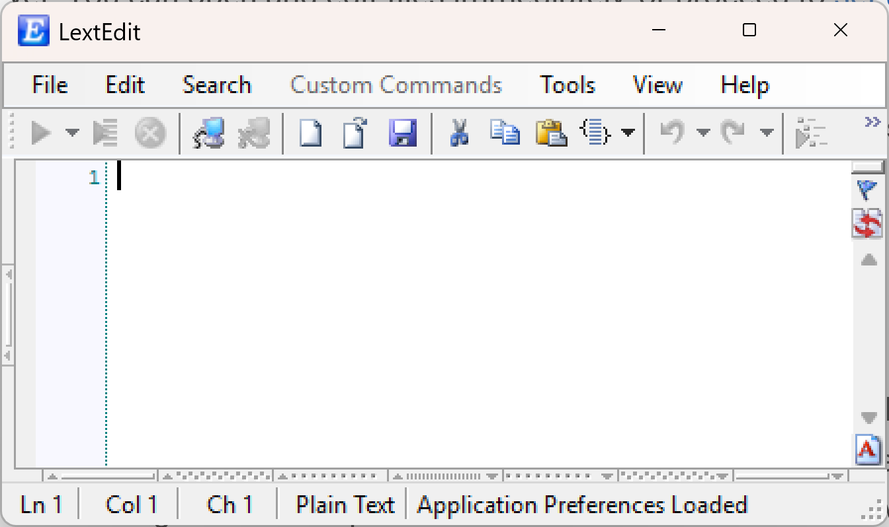

# Installation

LextEdit is a Windows-based application distributed as a downloadable installer. The installation process is straightforward and does not require administrator rights in most environments.

## System Requirements

- Windows 10 or later (32-bit or 64-bit)
- Network access to a MOCA/MSQL server, or a configured ODBC data source, for database connectivity
- Microsoft Excel or Access (optional) for ODBC-based spreadsheet connections

## Download

Visit [lextedit.com/downloads](https://www.lextedit.com/downloads) to download the latest version of LextEdit.

## Install

1. Run the downloaded installer.
2. Follow the on-screen prompts to complete installation.
3. Launch **LextEdit** from the Start menu or desktop shortcut.

The installer places all LextEdit files in a single directory (typically `C:\Program Files\LextEdit\`). No changes are made to system-level configuration files.

## First Launch

When LextEdit opens for the first time, the main editor window appears. No connection is active yet. You can open and edit files immediately, or proceed to [set up a connection](first-connection.md) to execute commands against a database system.

{ width="400" }

LextEdit does not require a database connection to be useful as a file editor. All syntax colorization and file operations are available offline.

## Updates

LextEdit includes a built-in update checker. Go to **Help &rarr; Check for Updates** to see if a newer version is available. It is recommended to check for updates periodically, as new releases often include bug fixes and improvements to the editor and connectivity features.
