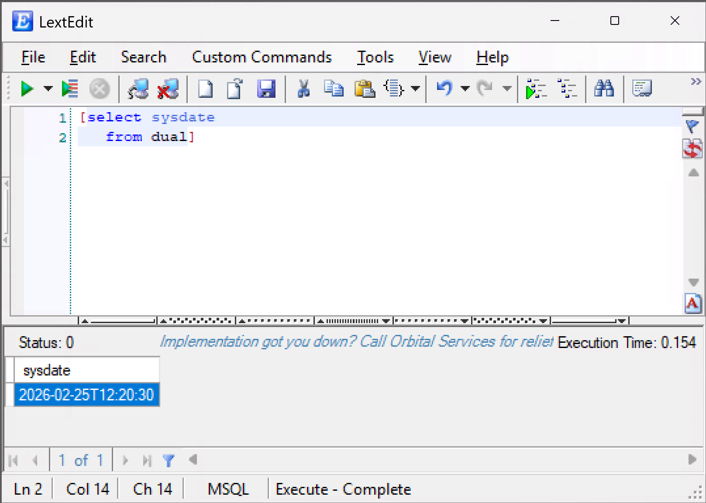

# LextEdit Documentation

**LextEdit** is a development tool for database systems built by [Orbital Services](http://www.orbitalservices.com). It combines a powerful file editor, a semantic parser for over 20 programming languages, and the ability to execute SQL and MOCA commands — displaying results in a usable data grid.

{ width="700" }

## What LextEdit Does

- **File editing** — open, edit, and save files locally with syntax colorization for 20+ languages
- **Database connectivity** — connect to MOCA/MSQL systems and ODBC data sources (including Microsoft Excel and Access databases)
- **Query execution** — run SQL and MOCA commands and view results in an interactive grid
- **Trace profiling** — open and analyze MOCA trace files with a structured tree view
- **File differencing** — compare two files side-by-side using the SyntaxDiff tool

LextEdit is designed by developers who use it daily. Features are driven by real-world usage, making it a solid and practical development tool.

## Documentation Sections

| Section | Description |
|---|---|
| [Getting Started](getting-started/index.md) | Install LextEdit, set up your first connection, and run your first query |
| [User Guide](user-guide/index.md) | In-depth coverage of every major feature |
| [Reference](reference/index.md) | Menus, keyboard shortcuts, command-line arguments, and more |

## About

LextEdit is developed and maintained by [Orbital Services](http://www.orbitalservices.com).
Copyright © 2026 LextEdit. All Rights Reserved.
