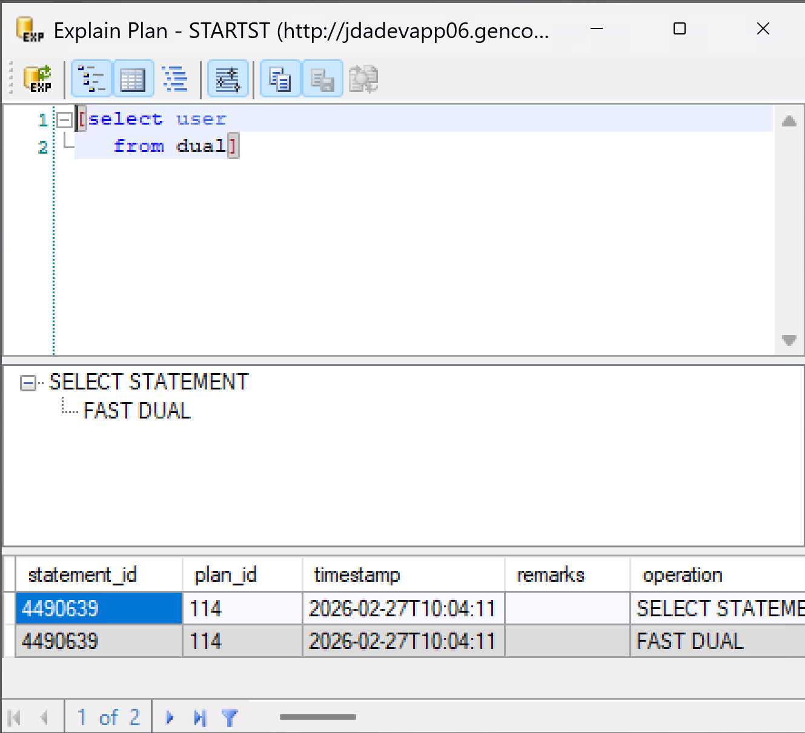

# Explain Query

The **Explain Query** tool analyzes SQL queries to help identify performance issues and understand how joins are being resolved. It is one of the most useful tools for diagnosing slow queries in a MOCA/SQL environment.

!!! note
    A MOCA connection is required for Explain Query to function.

## Opening Explain Query

- Press **Ctrl+E** with a query selected in the editor to open the Explain Query window for that query.
- From the Trace Profiler, double-click a SELECT statement to open it in an Explain Query window. This makes it easy to analyze a specific query that surfaced in a trace without having to copy and paste it manually.
- From the Trace Profiler toolbar, press **Ctrl+E** to open a blank Explain Query window.

## Interface

{ width="700" }

The Explain Query window contains three areas:

1. **Query area (top)**: shows the query being analyzed
2. **Join tree (middle)**: displays the joins in a tree structure, showing how tables are being accessed. Each node in the tree represents a table access or join step. The structure reveals whether joins are resolved using indexes or full table scans.
3. **Data grid (bottom, optional)**: shows the actual data returned by the explain query. This can be useful for verifying that the query returns the expected rows alongside the structural analysis.

## Interpreting the Join Tree

The join tree is the primary diagnostic output of Explain Query. Each node in the tree shows:

- The table being accessed
- The access method (index lookup vs. full scan)
- The join type and direction

A well-optimized query will typically show index lookups at each join step. If a node shows a full table scan on a large table, that is a common indicator that an index is missing or that the WHERE clause conditions are not being applied in an optimal order.

## Use Cases

- Identify missing indexes or inefficient join paths
- Compare execution plans before and after query changes to verify that an optimization had the intended effect
- Quickly analyze queries surfaced in a trace file without leaving LextEdit
