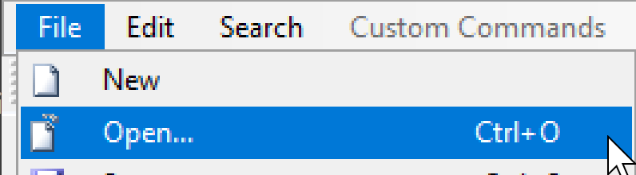
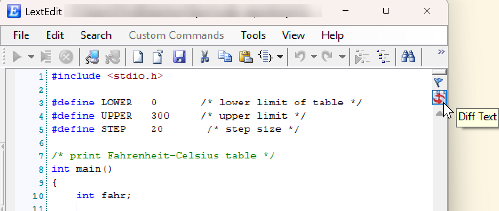
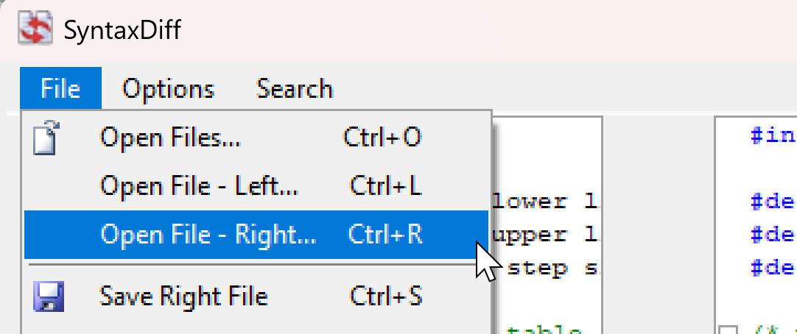
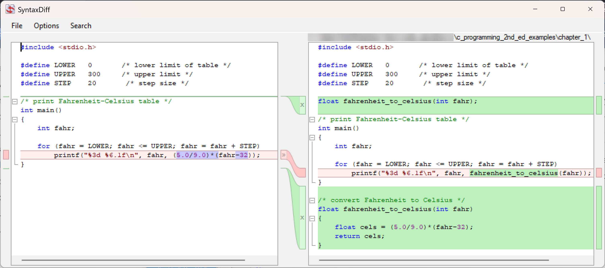
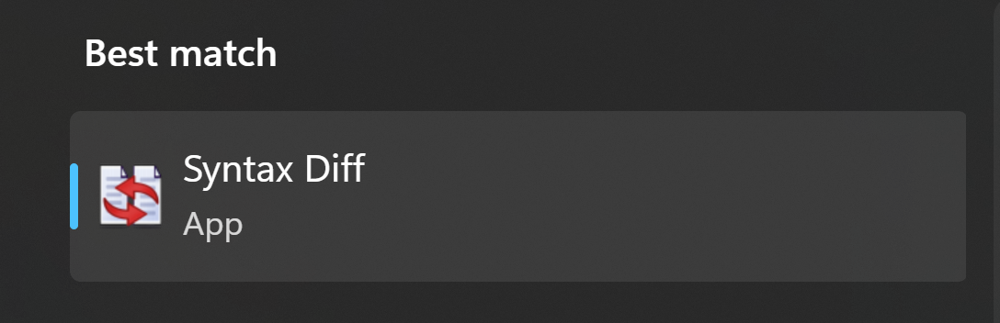
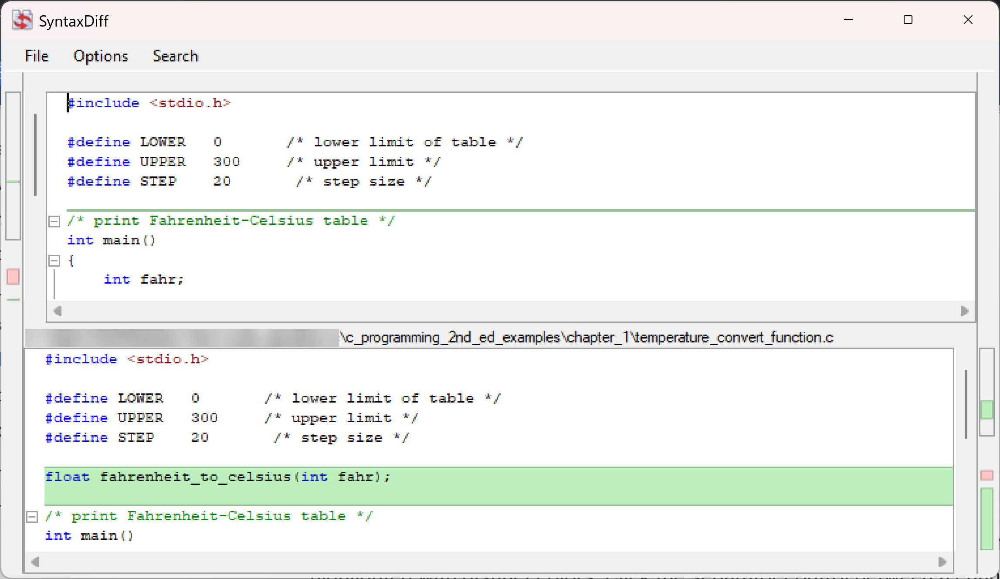

# File Differentiation

LextEdit includes **SyntaxDiff**, a file comparison tool for quickly identifying differences between two files or two versions of the same content. SyntaxDiff is useful for reviewing changes between file revisions, comparing deployed and local scripts, or validating the result of a bulk edit.

## Opening SyntaxDiff

SyntaxDiff can be triggered from the main LextEdit window to compare between executions or revisions of a file.

From a new Lext Edit instance, navigate to File --> Open in the menu. Select the target file...

{ width="200" }

Click the small Diff Text button on the right side of the window to launch Syntax Diff.

{ width="350" }

From Syntax Diff, use the File menu for three different Open File options.

{ width="250" }

The selected files should now be displayed with Syntax Diff features.

{ width="700" }

Alternatively, Syntax Diff can be launched from the Windows start menu as its own application instance.

{ width="250" }

## Display Modes

### Side-by-Side (Left-to-Right)

Both files are displayed in parallel columns with a separator control in the middle. Differences are highlighted with distinct colors. Click the separator control between a changed pair to apply or revert the change from one side to the other. This mode works best for files with relatively short lines where both sides can be comfortably viewed without horizontal scrolling.

### Top-and-Bottom (Left-above-Right)

One file is shown above the other. Useful when working with long lines that are difficult to compare side by side. In this mode, the vertical layout gives each file more horizontal space so that long lines can be read without truncation.

{ width="600" }

## Navigation

- **Colored bookmarks**: jump directly to the next or previous change. Each change is bookmarked automatically, so you can step through differences in sequence without scrolling manually.
- Click any change in the separator area to apply it between files

## Additional Options

- **Ignore whitespace**: differences that are only whitespace are excluded from the comparison. This is useful when comparing files that have been re-indented or reformatted without substantive changes.
- **Ignore case**: case differences are ignored. Useful when comparing MOCA commands or SQL that may have been typed in different cases but are functionally identical.
- **Line numbering**: optionally display line numbers in both panes
- **Drag and drop**: drag files directly into either comparison pane to load them
- **Syntax colorization**: both panes support grammatical colorization for 20+ languages, making code-level differences easier to read. For example, when comparing two versions of a MOCA script, keywords, strings, and comments remain visually distinct even within highlighted diff sections.
