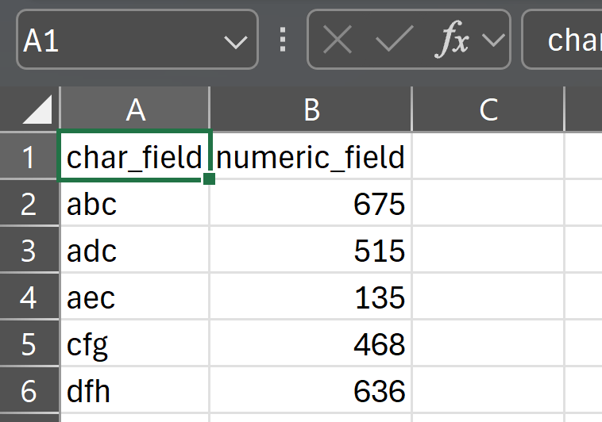
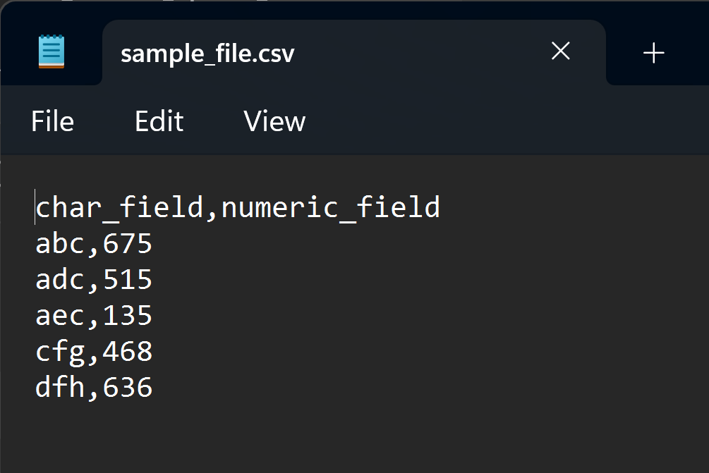
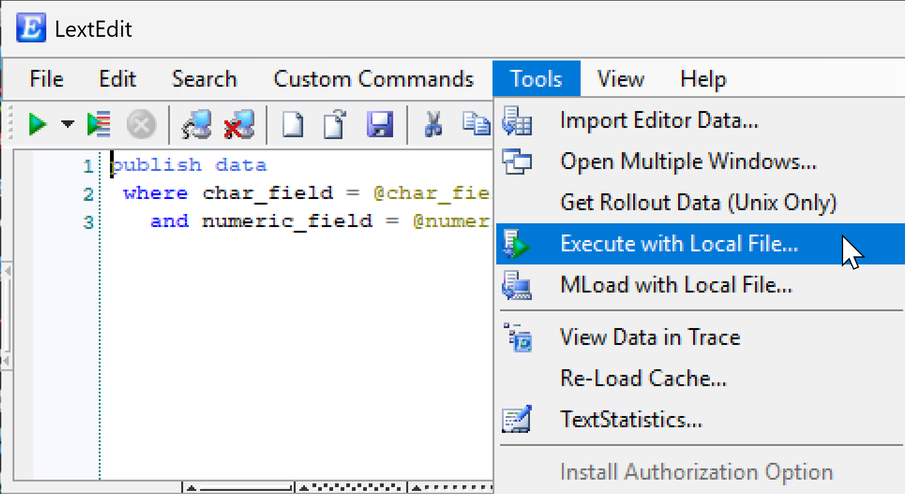
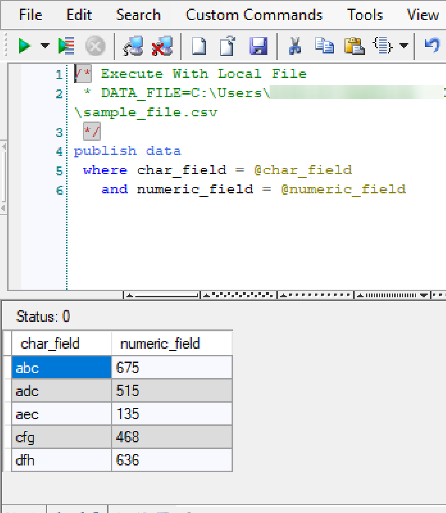

# The Editor

**LextEdit** is short for *Language Extendable Editor*. The editor is the central workspace in LextEdit, combining file editing with direct database connectivity in a single window.

## Overview

The main LextEdit window contains:

- A **text editor pane** for writing SQL, MOCA, or any supported language
- A **results grid** that displays data returned by executed commands
- A **toolbar** providing quick access to common actions

The editor and the results grid work together. You write a command in the editor, execute it, and the results populate the grid below without leaving the window.

## Editor Features

### Syntax Colorization

LextEdit provides grammatical and semantic parsing with colorization for over 20 programming languages. Colorization updates on the fly as you type. Unlike simple keyword-based highlighting, LextEdit's parser understands code structure, so it can colorize string literals, comments, operators, and identifiers accurately across complex multi-line scripts.

The active language can be changed at any time via **View &rarr; Language Style...**

### File Operations

- **Open**: `Ctrl+O` or drag and drop a file into the editor window
- **Save**: `Ctrl+S`
- **Save As**: File &rarr; Save As...

Files can also be loaded from the command line using the `-f` argument. See [Command-Line Arguments](../reference/command-line-arguments.md) for details.

### Text Editing

- **Undo / Redo**: standard Ctrl+Z / Ctrl+Y behavior
- **Indent / Outdent**: Edit &rarr; Indent or Outdent
- **Comment / Uncomment**: Edit &rarr; Comment Selection or Uncomment Selection
- **Uppercase (smart)**: `Ctrl+Shift+U` - uppercases selected text but preserves strings
- **Lowercase (smart)**: `Ctrl+U` - lowercases selected text but preserves strings
- **Format Code**: `Ctrl+Alt+F` - formats the current editor content

The smart uppercase and lowercase operations are particularly useful when working with MOCA/SQL, where column names and keywords are often uppercased but string values in WHERE clauses must remain unchanged.

### Code Snippets

Use **Edit &rarr; Insert Code Snippet** to insert pre-defined code templates. Snippets reduce repetitive typing for common patterns.

## Database Connectivity

When connected to a MOCA or ODBC system:

- **Execute**: `Ctrl+Enter` runs the current command context
- **Execute Selection**: `Ctrl+Shift+Enter` runs only selected text
- **Execute Script**: `Ctrl+Alt+Enter` runs the entire file contents
- **InteliPrompt**: autocomplete for MOCA commands, functions, tables, columns, and indexes

LextEdit determines the context boundary for `Ctrl+Enter` based on the cursor position relative to command separators and blank lines. This makes it practical to keep multiple commands in one file and run them individually.

Results are displayed in the grid below the editor.

## Toolbar Access to Other Tools

From the editor toolbar you can directly open:

- **Trace Profiler**: click the TraceProfiler toolbar icon or press `Ctrl+T`
- **Component Lookup**: `Ctrl+L`
- **Explain Query**: `Ctrl+E`
- **History**: `Ctrl+H`

These tools open in separate windows and can remain open while you continue working in the editor.

## Import Editor Data

Use **Tools &rarr; Import Editor Data** to import data from the editor directly into the results grid. The first row is treated as the header row. This pairs well with the grid's copy options for code generation workflows. For example, you can paste a set of record values into the editor, import them into the grid, then right-click to generate INSERT statements for each row.

## Execute with Local File

Use **Tools &rarr; Execute with Local File** to run a command against every row in a local CSV file:

1. Prepare a CSV file with the required field headers and data rows.

{ width="250" }

Or

{ width="250" }

2. Paste the command you want to run into the editor.
3. Select **Tools &rarr; Execute with Local File**.
4. Locate and open your CSV file.

{ width="250" }

5. LextEdit shows a preview of the parsed data. Confirm to proceed.
6. LextEdit executes the command for all rows in a single pass.

{ width="250" }

This feature is useful for bulk updates or inserts driven by data prepared outside of LextEdit.
