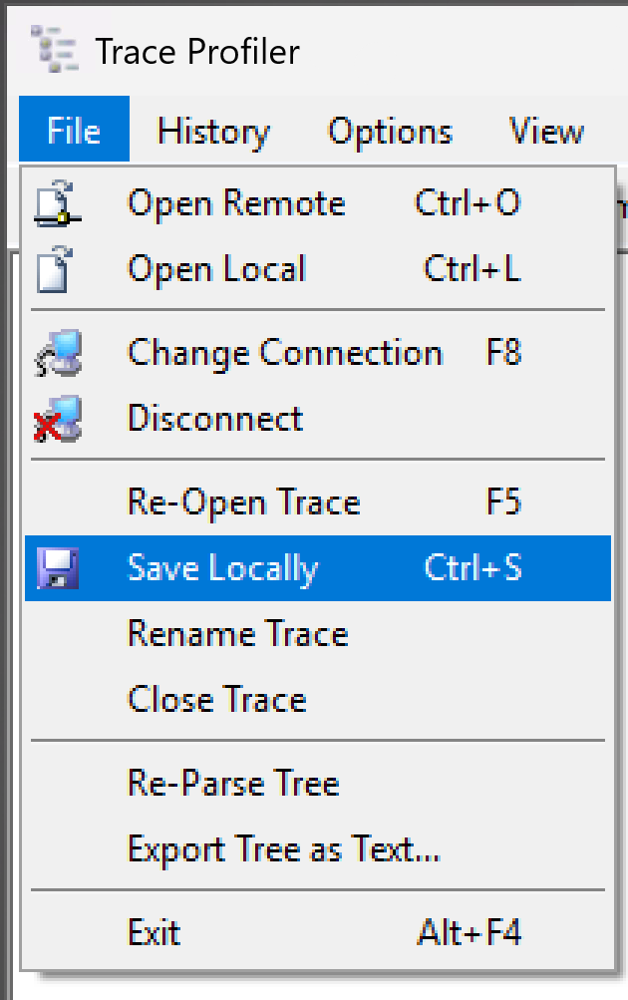

# Trace Profiler

The **TraceProfiler** is LextEdit's dedicated tool for opening and analyzing MOCA trace files. It can also load other ASCII-based log files. The Trace Profiler is a key tool for diagnosing performance issues and understanding command execution flow in MOCA-based systems.

## Opening the Trace Profiler

- Press **Ctrl+T** from the main LextEdit window, or click the TraceProfiler icon in the toolbar.
- The Trace Profiler can also be opened directly from the toolbar shortcut **F10** when inside the TraceProfiler window.

## Interface Overview

The TraceProfiler window is divided into two main areas:

- **Left panel**: a tree-based structure representing the interpreted trace, organized by command and sub-command. Each node in the tree represents a discrete command execution, including its duration and result.
- **Right panel**: the raw ASCII log text. Selecting a node in the tree highlights the corresponding text on the right, making it easy to locate specific log entries within a large file.

This side-by-side layout allows you to navigate the execution tree on the left while reading the raw log output on the right, without having to scroll through the entire file manually.

## Opening Trace Files

### From a Remote MOCA Connection

1. Press **Ctrl+O** inside the Trace Profiler to browse remote trace files.
2. The file dialog automatically sorts results in time order, with the most recent file pre-selected.
3. Multiple file types are available. Even files without profile information can be opened.

### From a Local File

- Press **Ctrl+L** to open a locally saved trace file.

Local files can be traces that were saved previously within the Trace Profiler, or trace files copied from a remote system by other means.

## Starting a Trace

From the main LextEdit window:

- **F9**: starts a MOCA server trace, using the current login name as the trace profile name
- **Ctrl+F9**: starts a trace and prompts you to enter a custom profile name

Custom profile names are useful when multiple users are tracing on the same system, or when you want to label a trace for a specific test or workflow. Once started, the trace runs on the server until you stop it. The resulting file can then be opened in the Trace Profiler.

## Finding Content

Use the find toolbar inside the TraceProfiler to search both the profile (tree) and log (text) sections. Searching within the tree is useful for locating specific commands or error messages in long traces.

## Saving Traces Locally

Press **Ctrl+S** inside the Trace Profiler to save the currently loaded trace as a local file. LextEdit automatically compresses the file on save. Saved traces can be reopened at any time with **Ctrl+L**.

{ width="700" }

Press **F5** to reopen the current trace file name. This refreshes the view if the file has been updated since it was last opened, which is useful when monitoring an ongoing trace.

## Profile Display Options

Go to **Tools &rarr; Profile Display Options** to customize how profile entries are displayed. You can add highlighting rules, for example, applying a green background to all policy-related entries, to make important patterns easy to spot. Highlighting rules are especially useful in long traces where a particular command type or pattern needs to stand out visually.

## Features Summary

- Easily accessed from the LextEdit toolbar
- Tree-based view for fast navigation of deep traces
- Filter by command type to reduce noise
- Customizable display rules
- Save and reload trace files locally (with automatic compression)
- Double-click SELECT statements to open them directly in an [Explain Query](../reference/explain-plan.md) window
